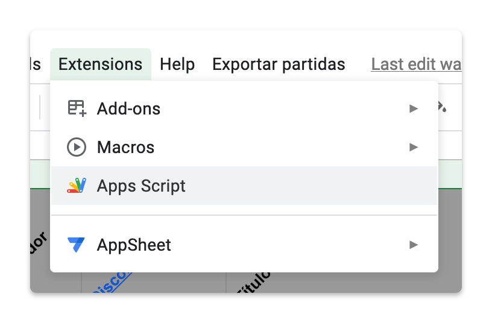
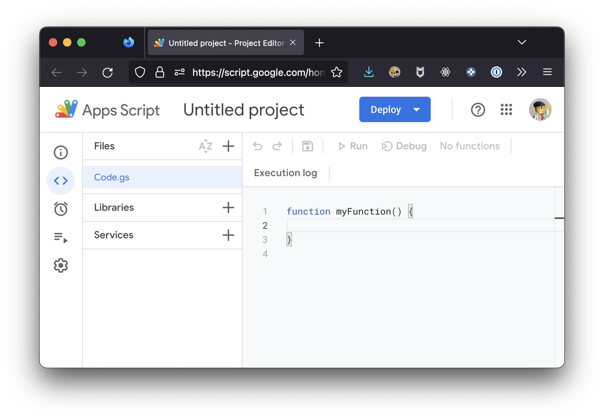
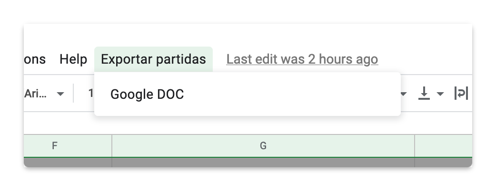

# RL Exportr 

<small>v1.1.0 | @20 Noviembre, 2022</small>

Appscript para generar un documento con el detalle de cada partida de cara a subirlo manualmente al plugin de eventos de la web.

## Instalación

En el documento de Google Sheets vamos al menú de Extensions (o Extensiones, depende del idioma), desplegamos y clicamos en la opción Apps Script:

<center> Apps Script" style="width:100%;max-width: 300px;"></center>

La primera vez que entras ves un espacio como este:
<center></center>

En la banda superior renombramos nuestro proyecto de **Untitled project** a **Exportr** (o como queramos).

Copiamos el código del archivo code.gs y sustituimos el actual:

```
funtion myFunction() {

}
```

En el código tendremos que buscar donde se escribe el ID de nuestro documento.
Este identificador lo tenemos en la url del documento de partidas: 
```
https://docs.google.com/spreadsheets/d/[Este es el identificador]/edit#gid=943885064
````

y tendremos que añadirlo en la siguiente línea, entre las comillas (sin las llaves)
```
const CUSTOMER_SPREADSHEET = '{Google Spreadsheet ID}';
```

Con esto ya tendríamos un nuevo menún en la hoja de partidas:

<center></center>

Si no es la primera vez y ya teníamos otro script nos dará la opción de crear uno nuevo.


## Ejecución

Cuando queramos exportar el contenido de las partidas del mes a un documento, abrimos las partidas, vamos a Exportar partidas > Google DOC y esto nos generará un documento en nuestro drive (puede que nos pida permiso para acceder la primera vez que lo ejecutemos) con el nombre RL_[mes sigueinte]_[año con dos cifras].

Si entramos en el drive y recargamos, nos aparece.

Ya.